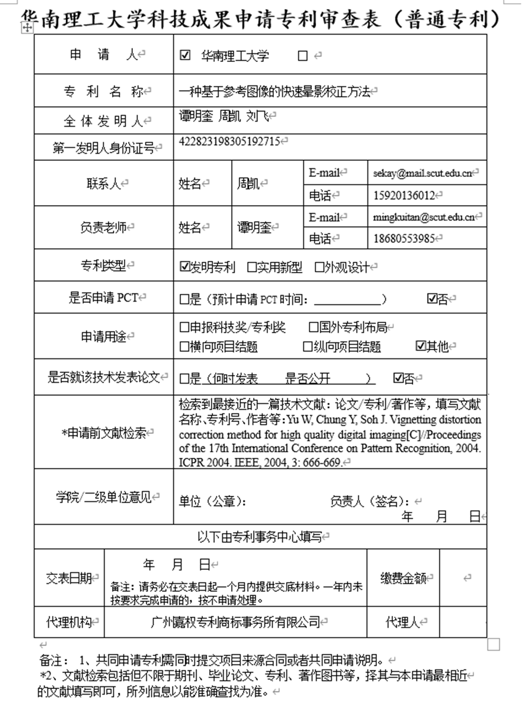
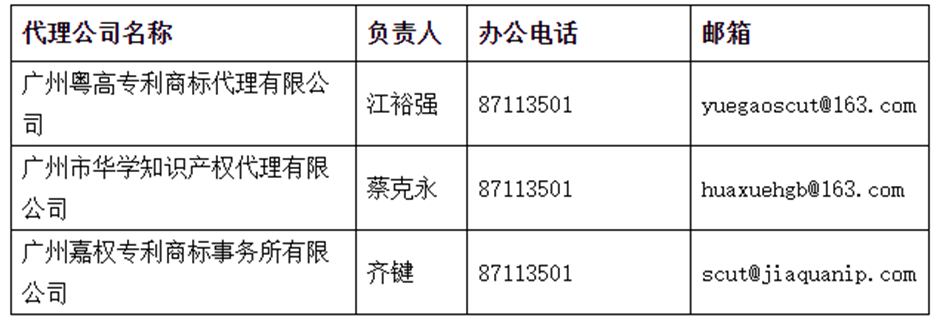
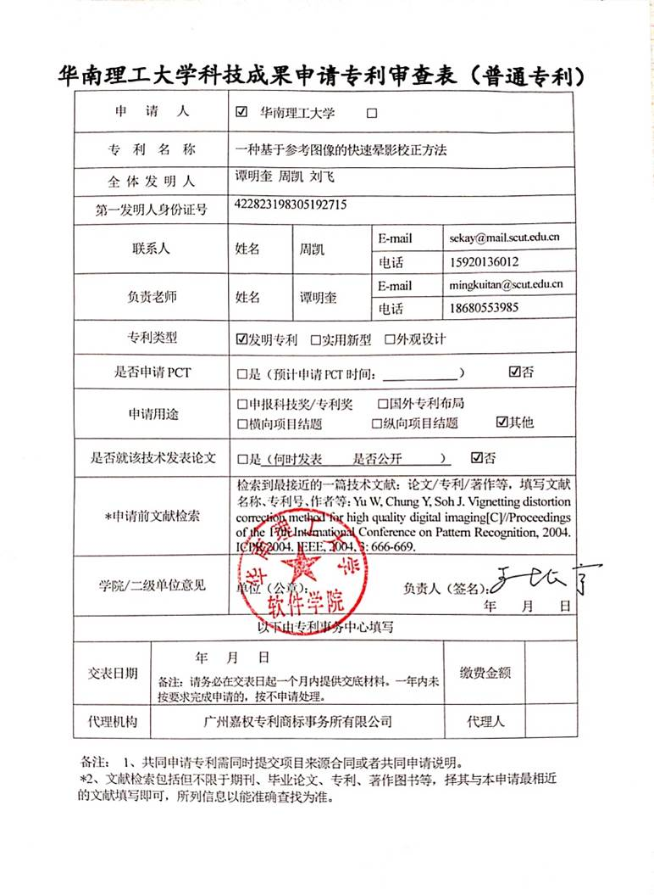
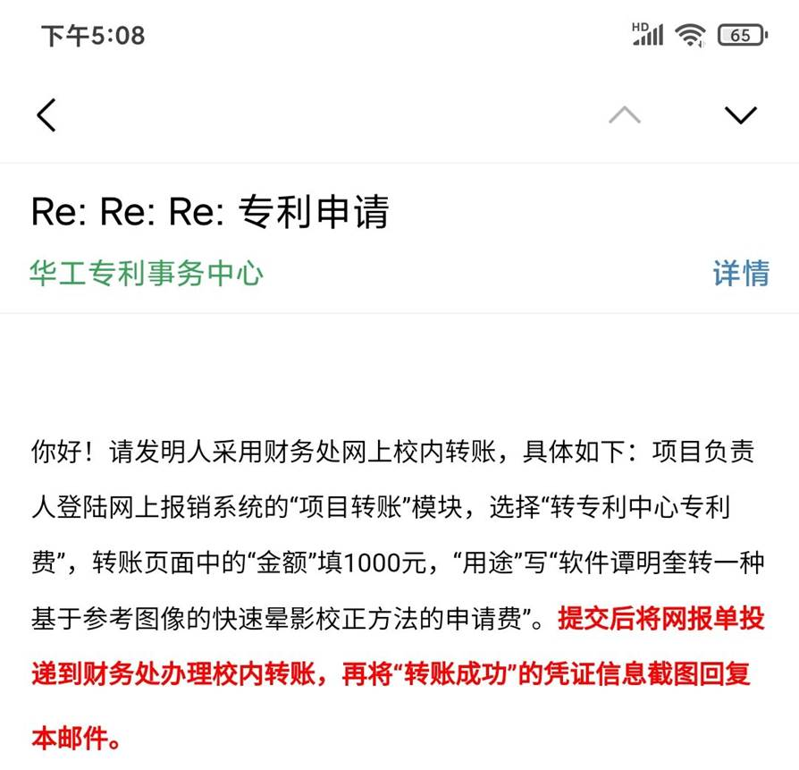
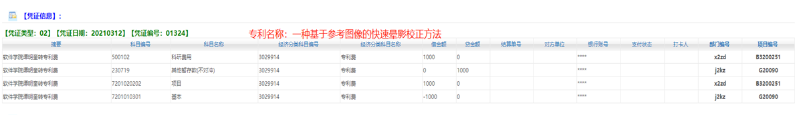
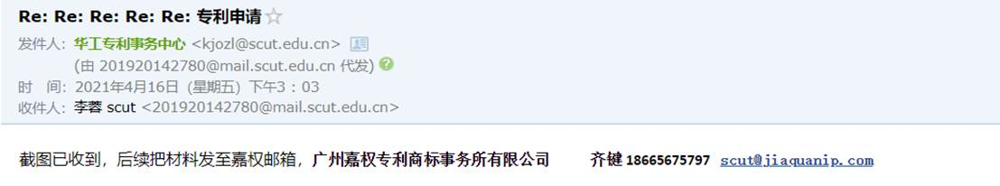
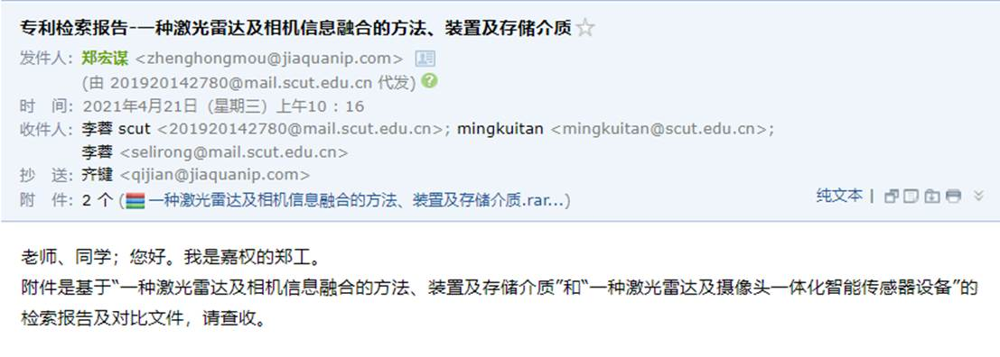
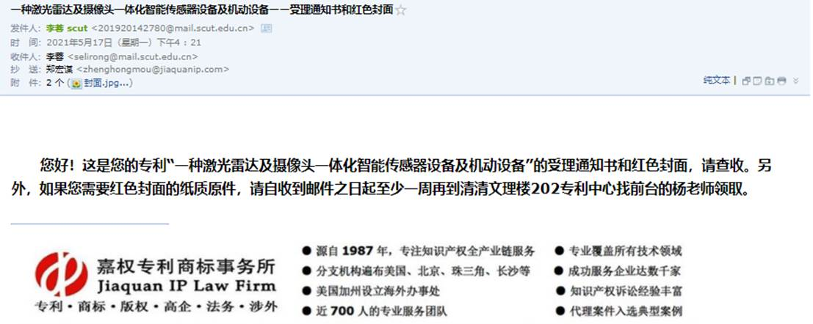
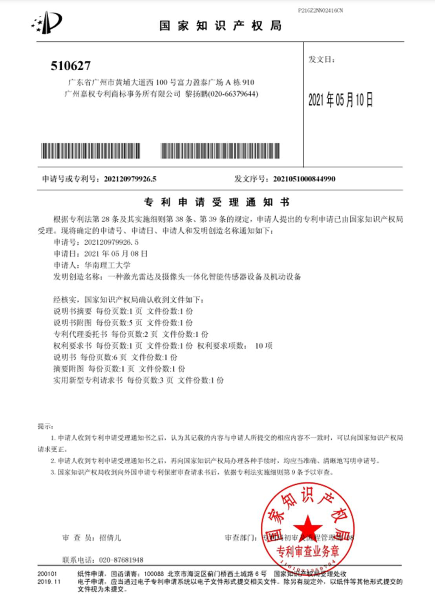
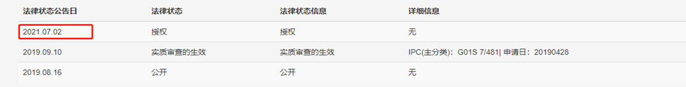

**校内专利申请流程（SMIL内部）**

# 准备专利技术交底书，填写专利审查表

专利审查表的模板，详见学校科技成果转化办公室官网

审查表下载路径：成果办—下载专区—知识产权申请

http://www2.scut.edu.cn/kz/zscqsq/list.htm

填写示例：

 

注：上述审查表的模板已经改变。

邮件要求： 直接图片格式，不要超大附件。

代理机构处，如果不填写，专利办则会随机指派跟学校合作的三家公司之一：

 

 

 

# 打印专利审查表，签字盖章

专利审查表打印好之后，去b7 101找陈秋余老师，在负责人（签名）处，盖上院长的签名章。然后去找主任盖学院公章。

 

# 扫描专利审查表，发送到专利中心邮箱

 

扫描版示例：

专利中心邮箱：kjozl@scut.edu.cn

# 根据邮件回复的指示，缴纳专利申请费

注：发明专利和实用新型的价格不一样。

 

把邮件发给杜卿老师进行校内转账，隔天在杜老师办公室（B7-411）拿**网报单，**交到B7-1楼的财务老师潘老师处登记。

 

最后等待杜卿老师发回给申请者转账截图，用截图回复邮件。

转账截图示例：

 

# 与专利代理公司对接，提交专利草稿，和专利代理人商量修改专利内容

学校专利中心会回复邮件，告知负责申请专利的公司联系方式。

 

把**专利草稿**发送到对应专利代理公司的邮箱，联系专利代理人修改专利内容，之后专利代理人帮忙申请专利。

# 收到专利检索报告

 

# 收到专利受理通知书

 

 

# 实验室内部登记

 发送专利信息给阳然同学进行登记。

 

 

# 查询专利申请进展情况

 

待提交专利申请之后几个月，自行查询申请进展情况，查询地址为国家知识产权局 https://www.cnipa.gov.cn/

 

专利的状态一般有三种，如下。

 

|      |                                               |
| ---- | --------------------------------------------- |
|      |  |

参考网址：疫情防控期间专利业务办理指引http://www2.scut.edu.cn/kz/2020/0218/c12689a362678/page.htm

 

其他关于专利的事情可以邮件联系华工专利事务中心 <kjozl@scut.edu.cn>  咨询。

 