# 服务器校外访问

## 前置条件

在校外需要访问校内服务器，首先需要本地生成密钥文件，然后将对应公钥(id_rsa.pub)发送给服务器的管理同学（目前是连梓豪），待管理员同学配置好之后才可以继续以下步骤。（此步骤自行搜索）

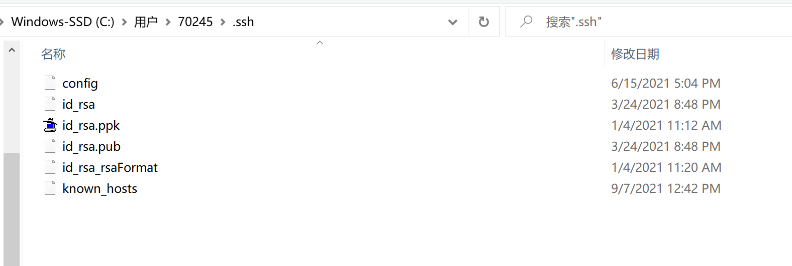

## 场景描述

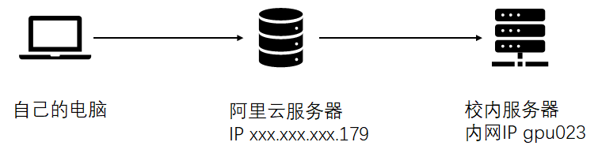

注意：gpuxxx指的是校内服务器的**校内网IP**

由于校园网的隔离限制，导致没法直接访问校内的服务器。所以得用跳板机打一下隧道。

为了安全考虑，校园网只有两台服务器（gpu010和gpu023）暴露接口给外网。剩下的服务器就要以这两台服务器为新的跳板去访问。

所以整个过程涉及两台跳板机：

- 第一层跳板机：自己购买的阿里云服务器
- 第二层跳板机：暴露端口给外网的校内服务器（gpu010或者gpu023）

## 建立第一条隧道，通过云服务器访问校内服务器gpu023

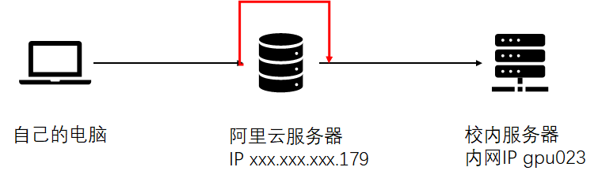

建立 红色的 tunnel 1，也叫做 SSH port forwarding。可以理解为在阿里云server上建立的一个穿透通路。这个通路一头是 阿里云服务器的port 2023，另一头是阿里云服务器的port 2222。

这个tunnel建立之后，表示云服务器自己（localhost）从port 2023收听到的message会被全部转发到localhost的2222。

为了安全考虑，在校内的gpu023服务器和阿里云服务器之间建立了单向的通道，即阿里云服务器不能访问校内服务器；但是校内服务器gpu023的 port 22在监听着阿里云服务器的port 2222发来的信息。

因此，只要是云服务器的port 2023收到的信息，都可以认为是校内gpu023:22收到的。可以把阿里云服务器的localhost:2023就看成gpu023:22。

只要建立了tunnel 1，则表示可以直接访问gpu023.

1. **配置阿里云服务器 Xshell**

   设置登录的服务器是**阿里云服务器**。在xshell上保存密码或者把本机密钥放在云服务上。

   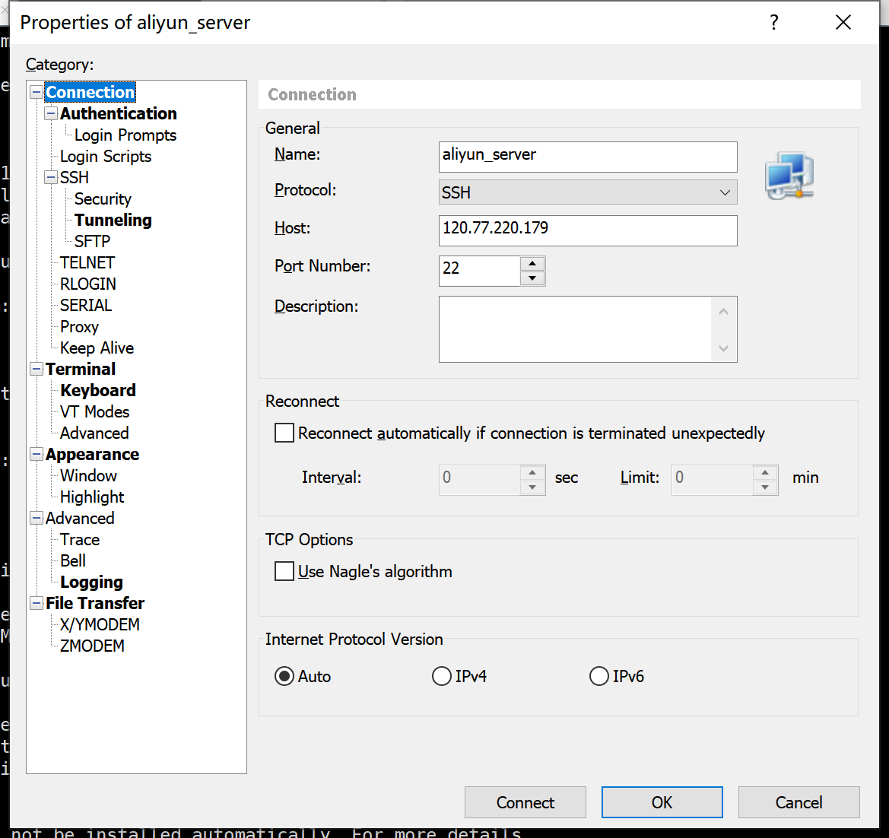

   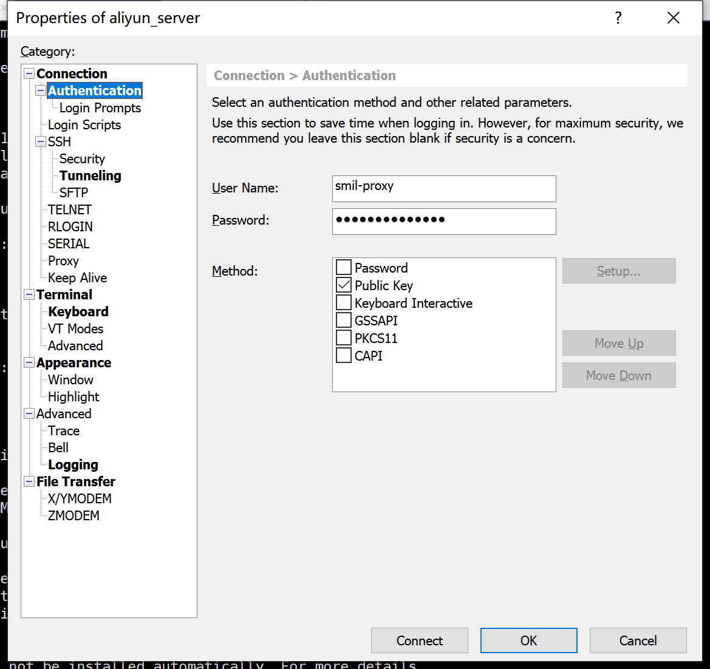

   在xshell上建立隧道，设置端口转发

   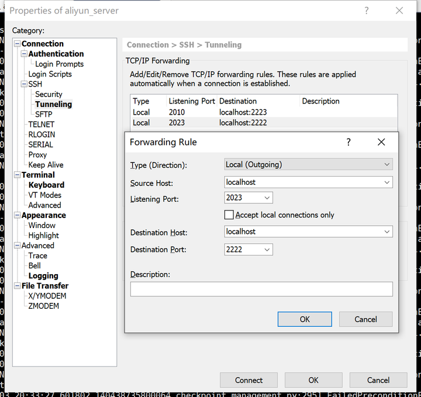

   点开这个建立好的session，则表示用本地电脑登录了阿里云服务器，并且这条建立好的tunnel准备好要转发2023端口的message到2222端口了。

   所以之后本地电脑发送到localhost:2023的消息都会直接被转发到localhost:2222，最终到达gpu023:22。

2. **配置gpu023/gpu010的Xshell**

   新建一个session

   

   

   点击这个session可以登录到gpu023/gpu010

## 建立隧道访问其他服务器

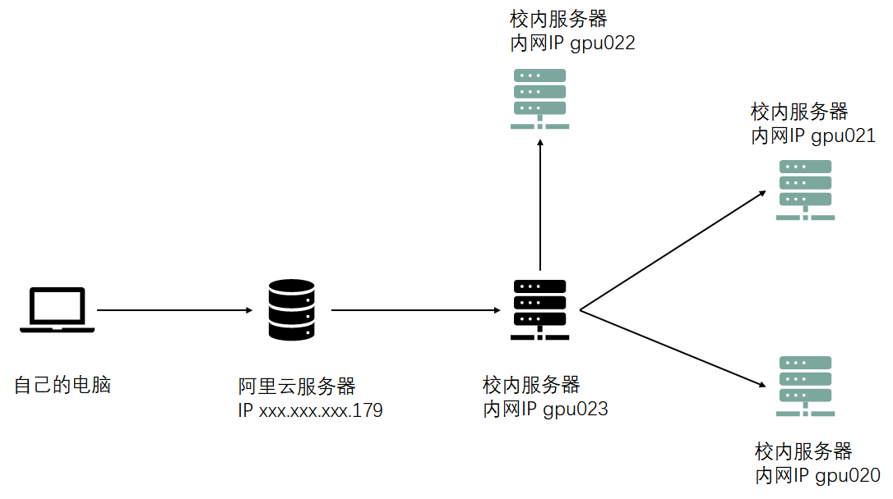

由于只有023，010暴露端口给外网了，所以剩下的其他服务器无法直接访问。因此，还需要把023作为第二层跳板机，来访问其他服务器。

1. **配置gpu023的Xshell**

   在**gpu023的xshell session**中建立一条新的隧道

   假设访问的是021

   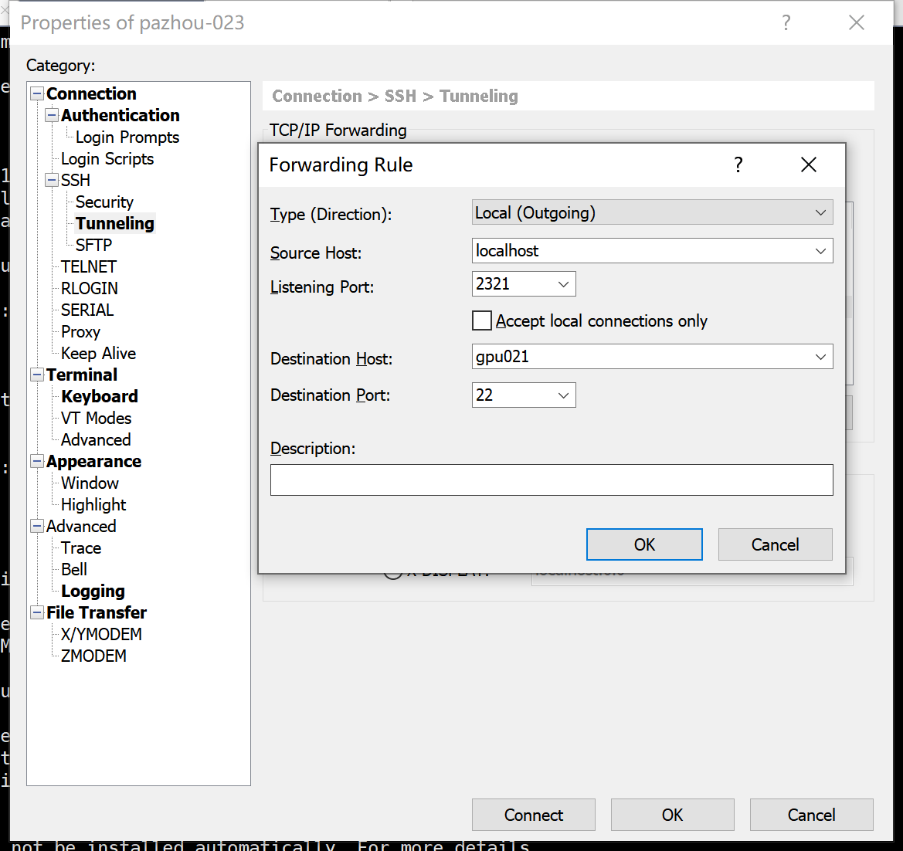

   所有localhost port 2321 收到的message都会转发给 gpu021:22.

2. **配置其他服务器的xshell**

   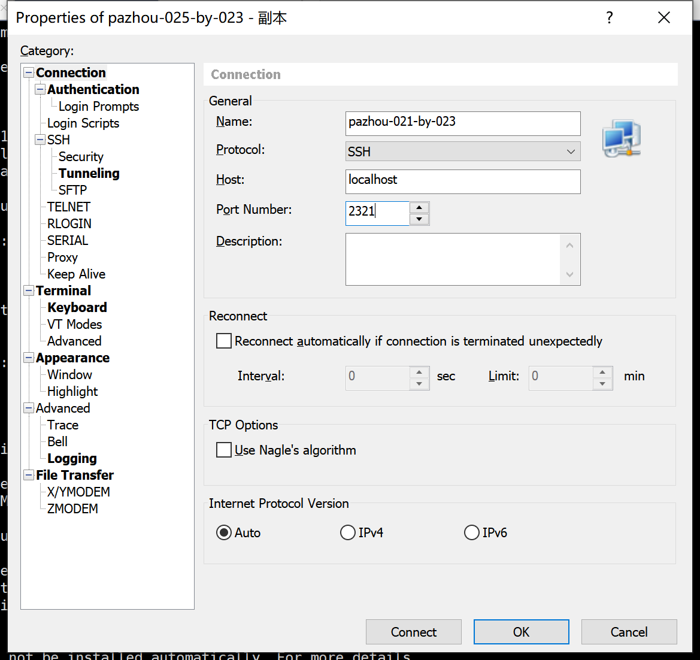

   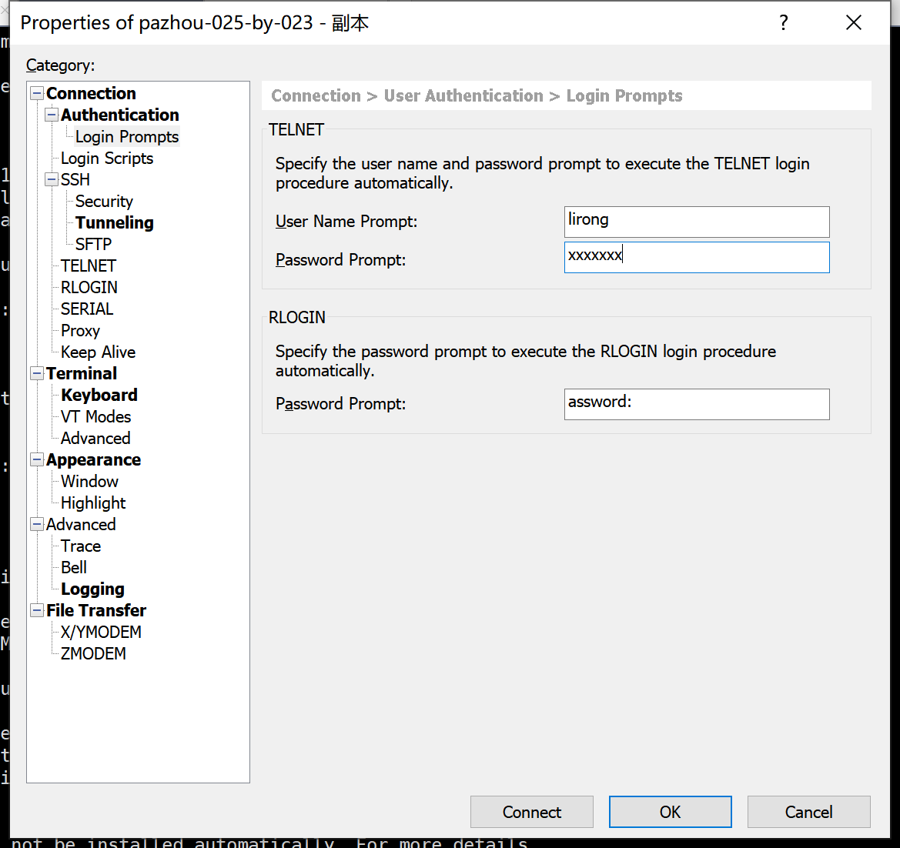

   之后在同时打开 aliyun server, gpu023两个session的情况下就能登录其他服务器

   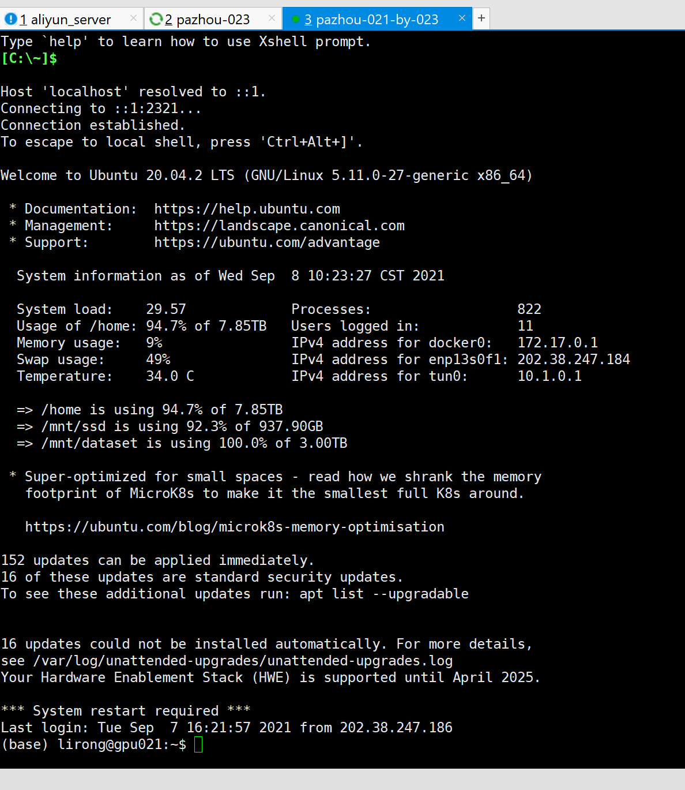

## 配置GPU pannel

在gpu023建立隧道

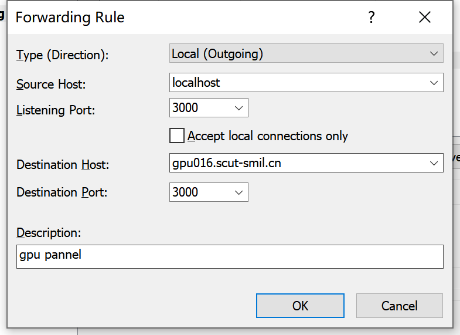

在浏览器的地址栏访问 http://localhost:3000/dashboards

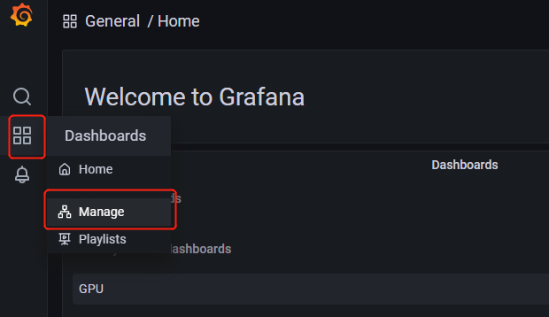

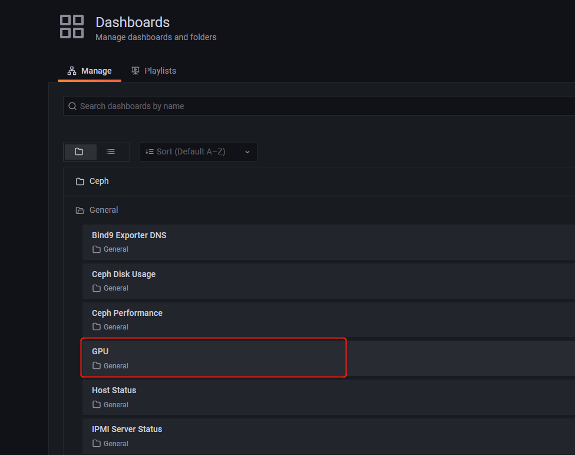
