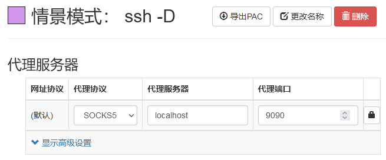
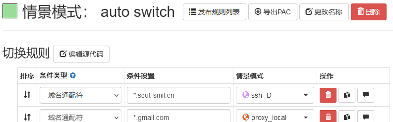

# Web服务校外访问

实验室的Web服务，如Grafana、NextCloud等一般都只能在校园网内访问。若需要在校外访问，可通过跳板机进行代理。

具体来说，可以配置ssh客户端的动态端口转发功能，然后配置浏览器通过ssh客户端代理连接到服务器。

## 设置ssh动态端口转发

ssh客户端通常具有动态端口转发功能，将自己配置为一个socks5协议的代理服务器，可将任意TCP连接转发至连接到的远程服务器。

<SelectTab subject='ssh_client'>
<SelectTabItem v='ssh' default>OpenSSH</SelectTabItem>
<SelectTabItem v='xshell'>Xshell</SelectTabItem>
</SelectTab>

<SelectContent s='ssh_client' v='ssh'>

请先完成[使用OpenSSH校外访问服务器](./remote-server-access.md?s:ssh_client=ssh)的配置。

然后在你连接服务器的命令的基础上加上`-D`参数：
```bash
ssh -D 9090 gpu023
```
此命令可让ssh监听9090端口，并将socks5代理协议的传入连接转发到gpu023，并从gpu023向指定目的地发起TCP连接。

</SelectContent>

<SelectContent s='ssh_client' v='xshell'>

TODO

</SelectContent>

## 配置浏览器代理设置

虽然你也可以直接修改全局的代理设置，但更推荐使用浏览器插件，只把需要代理的流量代理。

安装SwitchyOmega插件：
[chrome商店](https://chrome.google.com/webstore/detail/proxy-switchyomega/padekgcemlokbadohgkifijomclgjgif)、
[Firefox附加组件](https://addons.mozilla.org/zh-CN/firefox/addon/switchyomega/)、
[GitHub release](https://github.com/FelisCatus/SwitchyOmega/releases)。

安装完成后，打开插件的选项，单击“新建情景模式”，选择“代理服务器”，添加以下配置：


再次单击“新建情景模式”，选择“自动切换模式”，添加以下配置（第一行）：


最后点击插件图标，并激活刚刚创建的自动切换模式即可访问我们的Web服务了。
